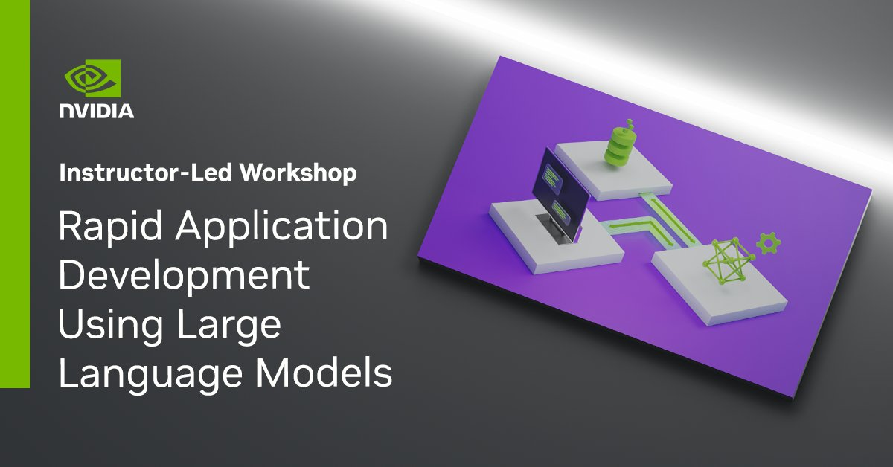

## Table of Contents
1. [Description](#description)
2. [Information](#information)
3. [Certificate](#certificate)

## Description

Recent advancements in both the techniques and accessibility of large language models (LLMs) have opened up unprecedented opportunities for businesses to streamline their operations, decrease expenses, and increase productivity at scale. Enterprises can also use LLM-powered apps to provide innovative and improved services to clients or strengthen customer relationships. For example, enterprises could provide customer support via AI virtual assistants or use sentiment analysis apps to extract valuable customer insights.

In this course, you’ll gain a strong understanding and practical knowledge of LLM application development by exploring the open-sourced ecosystem, including pre-trained LLMs, that can help you get started quickly developing LLM-based applications.

## Information
The overall goals of this course were the following:
> - Find, pull in, and experiment with the HuggingFace model repository and the associated transformers API;
> - Use encoder models for tasks like semantic analysis, embedding, question-answering, and zero-shot classification;
> - Use decoder models to generate sequences like code, unbounded answers, and conversations;
> - Use state management and composition techniques to guide LLMs for safe, effective, and accurate conversation;

More detailed information and links for the course can be found on the [course website](https://www.nvidia.com/en-eu/training/instructor-led-workshops/rapid-application-development-using-large-language-models/).

## Certificate

The certificate for the course can be found below:

- ["Rapid Application Development Using Large Language Models" - NVIDIA Deep Learning Institute](https://learn.nvidia.com/certificates?id=M8KczVk4RmS99WgWU7dHrQ) (Issued On: September 2024)
